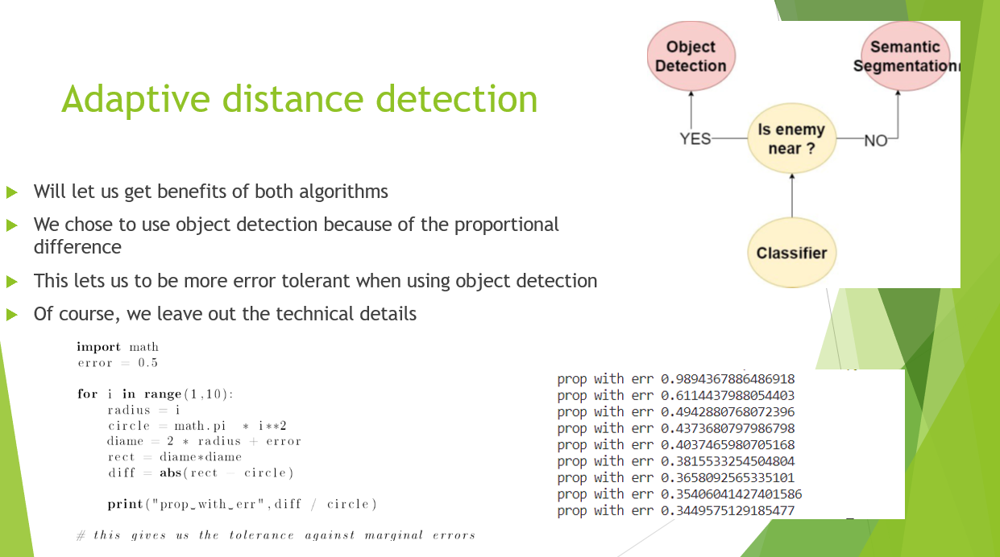
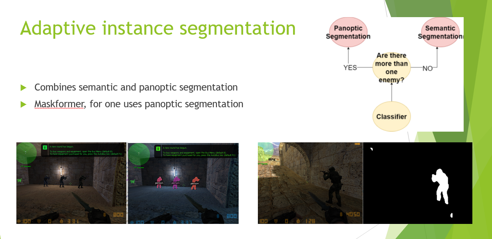

# Adaptive distance detection in Counter Strike: Conditional Zero
This paper is about object detection model and semantic segmentation model in an FPS game Counter Strike: Conditional Zero to detect enemies. Semantic segmentation is pixel-wise detection algorithm. We customized the architecture for semantic segmentation. We used YOLOv5s to train object detection model. After training, the inference time of semantic segmentation was compared to object detection. It was observed that object detection was slightly faster and semantic segmentation is slower but better at detecting the exact shape of the object. However, we found out that this slight difference of inference can grow exponentially if the both models get more complex. To solve this, we propose a novel approach called Adaptive distance detection which combines both algorithms. We will also introduce Adaptive instance segmentation to combine semantic segmentation and panoptic segmentation.

## Adaptive distance detection


## Adaptive instance segmentation


# Bibliography

We would like to thank MaskFormer for Bowen Cheng and Alexander G. Schwing and Alexander Kirillov and Ultralytics for contribution of MaskFormer and YOLOv5, which are the huge part of this project.


## MaskFormer
### License

Shield: [![CC BY-NC 4.0][cc-by-nc-shield]][cc-by-nc]

The majority of MaskFormer is licensed under a
[Creative Commons Attribution-NonCommercial 4.0 International License](LICENSE).

[![CC BY-NC 4.0][cc-by-nc-image]][cc-by-nc]

[cc-by-nc]: http://creativecommons.org/licenses/by-nc/4.0/
[cc-by-nc-image]: https://licensebuttons.net/l/by-nc/4.0/88x31.png
[cc-by-nc-shield]: https://img.shields.io/badge/License-CC%20BY--NC%204.0-lightgrey.svg


However portions of the project are available under separate license terms: Swin-Transformer-Semantic-Segmentation is licensed under the [MIT license](https://github.com/SwinTransformer/Swin-Transformer-Semantic-Segmentation/blob/main/LICENSE).

### <a name="CitingMaskFormer"></a>Citing MaskFormer

If you use MaskFormer in your research or wish to refer to the baseline results published in the [Model Zoo](MODEL_ZOO.md), please use the following BibTeX entry.

```BibTeX
@inproceedings{cheng2021maskformer,
  title={Per-Pixel Classification is Not All You Need for Semantic Segmentation},
  author={Bowen Cheng and Alexander G. Schwing and Alexander Kirillov},
  journal={NeurIPS},
  year={2021}
}
```

### MaskFormer: Per-Pixel Classification is Not All You Need for Semantic Segmentation

[Bowen Cheng](https://bowenc0221.github.io/), [Alexander G. Schwing](https://alexander-schwing.de/), [Alexander Kirillov](https://alexander-kirillov.github.io/)

[[`arXiv`](http://arxiv.org/abs/2107.06278)] [[`Project`](https://bowenc0221.github.io/maskformer)] [[`BibTeX`](#CitingMaskFormer)]

<div align="center">
  
</div><br/>


## YOLOv5
The following link guides you through the repository of YOLOv5 from Ultralytics, which is a team that focus on creating best models for AI tasks.
https://github.com/ultralytics/yolov5

<div align="center">
  <p>
    <a align="center" href="https://ultralytics.com/yolov5" target="_blank">
      </a>
  </p>
</div>


# Models
Models for adaptive distance detection and adaptive instance segmentation can be accessed from the following link:


https://bham-my.sharepoint.com/personal/kxj093_student_bham_ac_uk/_layouts/15/guestaccess.aspx?guestaccesstoken=SxuXc9H9Z9R95Ty9BosQxyAn5ck2HEzrKnfX3di6RWI%3D&folderid=2_0b9bc8c41f69b434f9e8bd8bc2ab282b4&rev=1&e=CmXu9q

The important models are cnn_far.h5, best.pt, jaccard_unet.h5 to run adaptive distance detection and cnx.h5, jaccard_unet.h5, model_final_7aa977.pkl for adatpive instance segmentation.


| Model                          | Mean IoU | Mean F1-score | Mean inference (s) |
|--------------------------------|----------|---------------|--------------------|
| Adaptive distance detection    | 0.41     | 0.56          | 0.54               |
| Adaptive instance segmentation | 0.70     | 0.82          | 1.02               |


# How to run the code
To use adaptive distance detection and adaptive instance segmentation, make sure you run the command

```powershell
    python .\demo\far_near_semantic.py
```
for adaptive distance detection or


```powershell
    python .\demo\instancesegfps.py --config-file 
    configs\ade20k-150-panoptic\maskformer_panoptic_R50_bs16_720k.yaml 
    --opts MODEL.WEIGHTS models\model_final_7aa977.pkl
```
for adaptive instance segmentation.

Note: you have to make sure you are in the root folder.


# Datasets
Our dataset is accessible through

https://bham-my.sharepoint.com/personal/kxj093_student_bham_ac_uk/_layouts/15/guestaccess.aspx?guestaccesstoken=rvIGeIzPxJnJXjp%2F7%2B%2FqWFGOMPCq6FqbS704s8XVlMI%3D&folderid=2_01627a697d56d4b7e996f1f76cd490ffe&rev=1&e=NpTwNC

Here you can see the images we chose to train our models.

# Notebooks
The notebooks on which contains the code we train our models are in /colab


